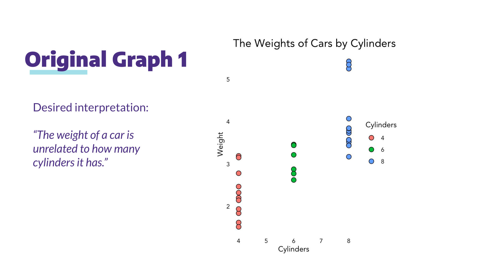
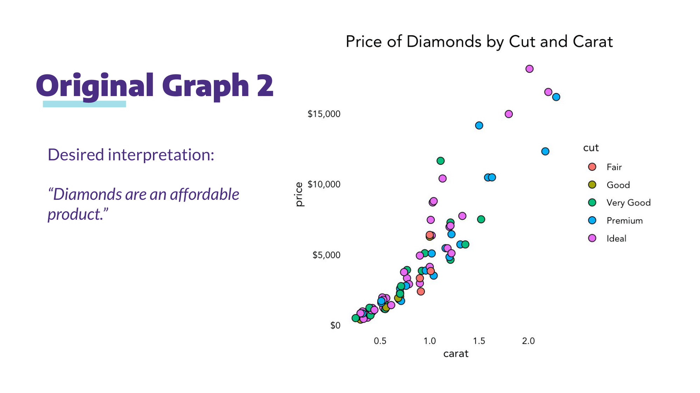
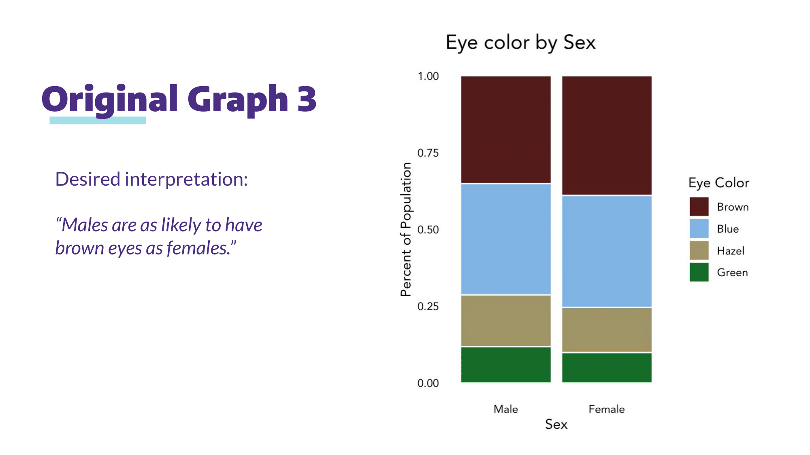

```{r setup, include=FALSE}
knitr::opts_chunk$set(echo = TRUE)

library(dplyr)
library(ggplot2)

setwd("E:\\UW\\Autumn Quarter 2021\\HCDE 411\\misleading-charts")

cars_data <- read.csv(paste(getwd(), "/data/Cars.csv", sep=""))
diamonds_data <- read.csv(paste(getwd(), "/data/Diamonds.csv", sep=""))
eye_color_data <- read.csv(paste(getwd(), "/data/EyeColor.csv", sep=""))
```





```{r, echo=TRUE}
cars_chart <- ggplot(cars_data, aes(x = cyl, y = wt)) +
  geom_point() +
  ylim(2.5, 3.5) +
  labs(title = "The Weights of Cars by Cylinders")
update_labels(cars_chart, list(x = "Cylinders", y = "Weight"))
```

I truncated the y-axis so that the range of values shown on the graph would be much smaller and would not show all of the data on the chart.

```{r, echo=TRUE}
diamonds_chart <- ggplot(diamonds_data, aes(x = carat, y = price / 1000)) +
  geom_point() +
  labs(title = "Price of Diamonds by Carat")
update_labels(diamonds_chart, list(x = "Carat", y = "Price (in thousands)"))
```

I changed the label of the y-axis to show the price in thousands instead of listing out the original price, adding unnecessary abstraction to the chart.

```{r, echo=TRUE}
eye_color_chart <- ggplot(eye_color_data, aes(x = Sex, y = EyeTotal, fill = Eye)) +
  geom_bar(stat = "identity") +
  ylim(0, 5000) +
  labs(title = "Eye Color by Sex") +
  scale_fill_manual(values = c("Brown" = "brown",
                             "Blue" = "blue",
                             "Hazel" = "#C9C789",
                             "Green" = "green"))
update_labels(eye_color_chart, list(x = "Sex", y = "Number of People"))
```

I rearranged the stacked bars and increased the range of the y-axis so that the data is hard to read and the difference between the number of females with brown eyes and the number of males with brown eyes is indiscernible.
